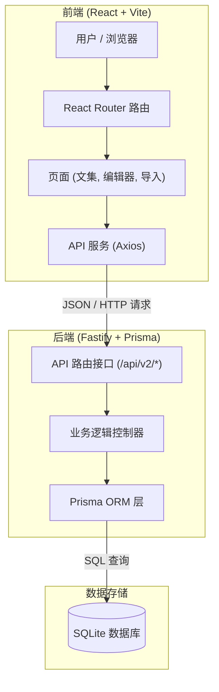
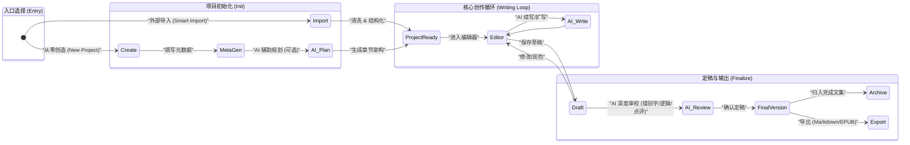
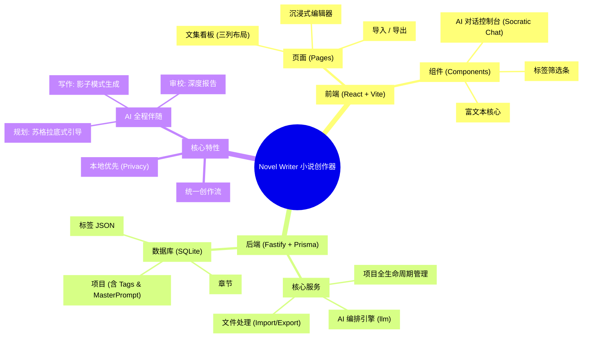

# 系统架构与业务逻辑流程 (System Architecture)

本文档详细说明了 **Novel Writer** 小说创作应用的系统技术架构及核心业务流程。

## 1. 高层系统架构 (High-Level Architecture)

本系统采用现代化的 **B/S 架构 (Client-Server)**，实现 React 前端与 Fastify 后端的分离。

## 2. 统一创作心流 (Unified User Flow)

无论通过“外部导入”还是“从零创造”，用户最终都将汇聚于统一的创作心流中。

## 3. AI 全生命周期介入 (AI Integration Lifecycle)

AI 不仅仅是打字机，而是贯穿创作全流程的合作伙伴。

*   **规划期 (Planning)**:
    *   **伴侣模式**: 在创建项目时，根据简单的“一句话灵感”，AI 协助扩展世界观、人物小传和章节大纲。
*   **写作期 (Writing)**:
    *   **助手模式**: 续写卡文处、生成环境描写、优化对话对白。
*   **审校期 (Reviewing)**:
    *   **编辑模式**: 在定稿前，AI 扮演“严厉编辑”，检查时间线冲突、人物性格OOC（角色崩坏）、错别字及行文节奏。

## 4. 文集管理策略 (Collection Strategy)

采用 **“三列看板 (Kanban)”** + **“标签系统 (Tags)”** 结合的视觉化管理。

| 看板泳道 (Kanban Column) | 对应状态 (Status) | 交互行为 (Interaction) |
| :--- | :--- | :--- |
| **外部导入 (Imported)** | `imported` | **黄色卡片**。来自 Smart Import 的素材暂存区，点击“开始创作”可移动至下一阶段。 |
| **原创构思 (Original)** | `draft` / `writing` | **蓝色卡片**。核心创作区。支持 `#标签` 筛选（如 `#玄幻` `#大女主`）。点击“完成”移动至归档。 |
| **完结归档 (Completed)** | `completed` | **绿色卡片**。荣誉殿堂。支持一键导出 Markdown。**支持“返回修改”**（回退到原创构思列）。 |

## 5. 项目功能思维导图 (Project Mind Map)

