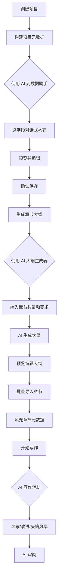
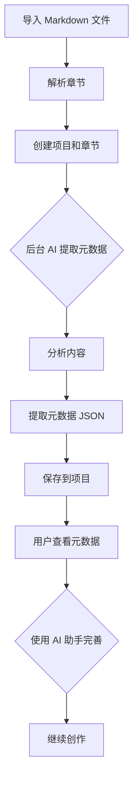

# AI 元数据管理系统 - 全面复盘报告

**审查时间**: 2025-12-23  
**审查范围**: Phase 1-5 全部功能  
**审查重点**: 创作流程、组件交互、AI 接入安全性

---

## 一、创作流程完备性检查

### 1.1 全新创作流程 ✅



**状态**: ✅ 完整  
**关键节点**:
- ✅ 项目创建 (`ProjectDetailPage`)
- ✅ 元数据构建 (`AIMetadataAssistant` + `ProjectMetadataPanel`)
- ✅ 大纲生成 (`ChapterOutlineGenerator`)
- ✅ 章节创建 (批量 API)
- ✅ 写作辅助 (现有功能，已强化)
- ✅ AI 审阅 (现有功能，已强化)

### 1.2 导入已有作品流程 ✅



**状态**: ✅ 完整  
**关键节点**:
- ✅ 导入接口 (`POST /projects/import`)
- ✅ 后台提取 (`extractMetadataInBackground`)
- ✅ 元数据查看 (`ProjectMetadataPanel`)
- ✅ 元数据完善 (`AIMetadataAssistant`)

---

## 二、组件交互流转检查

### 2.1 前端组件依赖关系

```
ProjectDetailPage
├── ChapterOutlineGenerator (AI 大纲生成)
│   └── aiApi.generateChapterOutline()
│   └── chaptersApi.create() (批量)
│
ProjectMetadataPanel
├── AIMetadataAssistant (AI 元数据助手)
│   └── aiApi.metadataChat()
│   └── projectsApi.updateMetadata()
│
ChapterMetadataPanel
├── AIMetadataAssistant (AI 元数据助手)
│   └── aiApi.metadataChat()
│   └── chaptersApi.updateMetadata()
│
Editor (现有)
├── AI 写作辅助
│   └── aiApi.getWritingSuggestion()
├── AI 审阅
│   └── aiApi.reviewChapter()
```

**状态**: ✅ 完整  
**交互流程**:
1. ✅ 用户操作 → 前端组件
2. ✅ 前端组件 → API 调用
3. ✅ API → 后端路由
4. ✅ 后端路由 → AI 服务
5. ✅ AI 响应 → 前端展示
6. ✅ 用户确认 → 数据保存

### 2.2 后端服务依赖关系

```
AI Routes (/api/ai/*)
├── PromptManager (构建 Prompt)
│   └── ContextManager (构建上下文)
│       └── Prisma (查询数据库)
├── AIService (调用 AI API)
│   └── Gemini API
│
Projects Routes (/api/projects/*)
├── Import 接口
│   └── extractMetadataInBackground()
│       └── PromptManager
│       └── AIService
│       └── Prisma (保存元数据)
```

**状态**: ✅ 完整  
**数据流**:
1. ✅ 请求 → 路由验证
2. ✅ 路由 → 服务调用
3. ✅ 服务 → 数据库操作
4. ✅ 响应 → 前端

---

## 三、AI 接入安全性和可靠性检查

### 3.1 AI API 调用点清单

| 功能 | API 端点 | Prompt 方法 | 状态 |
|------|---------|------------|------|
| 元数据对话构建 | `/ai/metadata/chat` | `getMetadataGuidedPrompt` | ✅ |
| 元数据提取 | `/ai/metadata/extract` | `getMetadataExtractPrompt` | ✅ |
| 章节大纲生成 | `/ai/chapters/generate-outline` | `getChapterOutlinePrompt` | ✅ |
| AI 写作辅助 | `/ai/chat` | `getWritingSystemPrompt` | ✅ |
| 章节审阅 | `/ai/review/chapter` | `getChapterReviewSystemPrompt` | ✅ |
| 全局审阅 | `/ai/review/global` | `getReviewSystemPrompt` | ✅ |

**总计**: 6 个 AI 调用点，全部实现 ✅

### 3.2 错误处理机制

#### ✅ 已实现的错误处理

1. **前端层面**:
   ```typescript
   // AIMetadataAssistant.tsx
   try {
     const response = await aiApi.metadataChat(...)
     if (response.success && response.data?.content) {
       // 处理成功
     } else {
       throw new Error(response.error?.message || '错误')
     }
   } catch (err: any) {
     setError(err.message || '请稍后重试')
   }
   ```

2. **后端层面**:
   ```typescript
   // ai.ts
   try {
     const response = await aiService.chat(messages)
     return { success: true, data: { content: response } }
   } catch (error: any) {
     request.log.error(error, 'AI chat failed')
     return reply.code(500).send({ error: error.message })
   }
   ```

3. **JSON 解析保护**:
   ```typescript
   // ChapterOutlineGenerator
   try {
     const jsonMatch = response.match(/```(?:json)?\n([\s\S]*?)\n```/)
     outline = JSON.parse(jsonStr)
   } catch (parseError) {
     return reply.code(500).send({ error: 'AI 返回格式无法解析' })
   }
   ```

#### ⚠️ 潜在问题 1: 缺少重试机制

**问题**: AI API 调用失败后没有自动重试  
**影响**: 网络波动可能导致用户体验不佳  
**建议**: 添加重试逻辑（最多 3 次）

#### ⚠️ 潜在问题 2: 超时处理不明确

**问题**: 没有明确的超时设置  
**影响**: 长时间等待可能导致用户焦虑  
**建议**: 设置合理的超时时间（30-60 秒）

### 3.3 用户确认机制

#### ✅ 已实现的确认点

1. **元数据保存确认**:
   - ✅ `AIMetadataAssistant`: 明确的"确认保存"按钮
   - ✅ 警告提示: "保存后，此内容将成为 AI 写作和审阅的核心约束条件"

2. **大纲导入确认**:
   - ✅ `ChapterOutlineGenerator`: 明确的"导入为章节"按钮
   - ✅ 可编辑: 导入前可以逐章编辑

3. **写作辅助确认**:
   - ✅ 现有功能: 用户手动插入 AI 建议

#### ⚠️ 潜在问题 3: 导入元数据提取无确认

**问题**: 导入文章后，AI 自动提取的元数据直接保存，用户无法预览确认  
**影响**: 可能提取错误或不符合用户预期  
**建议**: 添加一个"元数据预览和确认"步骤

### 3.4 元数据约束执行

#### ✅ 已强化的约束

1. **ContextManager**:
   ```typescript
   // 明确标注元数据的"宪法"地位
   === 核心元数据 (TIER A - 宪法级约束) ===
   ```

2. **PromptManager**:
   ```typescript
   // 所有 Prompt 都强调元数据约束
   ⚠️ 核心约束（必须严格遵守）：
   1. 严格遵守项目梗概中的核心冲突和主题
   2. 遵循情节结构的起承转合
   ...
   ```

3. **写作辅助克制性**:
   ```typescript
   // 续写限制 300 字
   // 改进不改变情节
   // 头脑风暴 3 个建议，每个 50 字
   ```

**状态**: ✅ 完整实现

---

## 四、关键隐患和担心

### 🔴 严重隐患

#### 1. 导入元数据提取缺少用户确认 (严重)

**问题描述**:
- 导入文章后，AI 在后台自动提取元数据并直接保存
- 用户无法预览、确认或修改提取的内容
- 如果 AI 提取错误，用户可能不知道

**影响**:
- 元数据是"宪法"，错误的元数据会影响所有后续 AI 功能
- 用户失去对核心数据的控制权

**建议修复**:
```typescript
// 修改 extractMetadataInBackground
// 1. 提取后保存到临时字段 (metadata_draft)
// 2. 前端显示通知，引导用户查看
// 3. 用户确认后才正式保存到 metadata
```

#### 2. AI API 失败时的降级策略缺失 (中等)

**问题描述**:
- 如果 AI API 完全不可用，整个元数据构建流程会中断
- 没有手动输入的备选方案

**影响**:
- AI 服务故障时，用户无法继续工作

**建议修复**:
- 在 `AIMetadataAssistant` 中添加"手动输入"模式
- 在 `ChapterOutlineGenerator` 中添加"手动创建章节"选项

### 🟡 中等隐患

#### 3. 元数据字段缺少验证 (中等)

**问题描述**:
- AI 生成的元数据没有格式验证
- 可能生成不符合预期结构的数据

**影响**:
- 后续 AI 功能可能无法正确读取元数据

**建议修复**:
```typescript
// 添加 Zod schema 验证
const ProjectMetadataSchema = z.object({
  synopsis: z.string().optional(),
  characters: z.string().optional(),
  // ...
})
```

#### 4. 长文本处理可能超出 token 限制 (中等)

**问题描述**:
- 导入大型作品时，合并的内容可能超出 AI token 限制
- 当前只是简单截断到 50k 字符

**影响**:
- 可能丢失重要信息
- 提取的元数据不完整

**建议优化**:
- 智能摘要：提取每章的关键段落
- 分段提取：分别提取人物、情节、世界观等

### 🟢 轻微隐患

#### 5. 用户体验细节

**问题**:
- 没有明确的"AI 正在思考"动画
- 没有进度指示器（特别是大纲生成可能需要较长时间）

**建议**:
- 添加更友好的加载动画
- 显示预估时间

---

## 五、测试建议

### 5.1 必须测试的场景

#### 场景 1: 全新创作流程
1. ✅ 创建项目
2. ✅ 使用 AI 助手构建项目元数据（梗概、人物、世界观）
3. ✅ 生成 20 章大纲
4. ✅ 编辑部分章节标题
5. ✅ 批量导入
6. ✅ 进入编辑器，测试 AI 续写
7. ✅ 测试 AI 审阅

#### 场景 2: 导入已有作品
1. ✅ 导入 Markdown 文件（10 章以上）
2. ⚠️ 等待元数据提取完成
3. ⚠️ 查看提取的元数据（**需要添加通知机制**）
4. ✅ 使用 AI 助手完善元数据
5. ✅ 测试 AI 续写是否遵守元数据

#### 场景 3: 错误处理
1. ⚠️ AI API 不可用时的表现
2. ⚠️ AI 返回无效 JSON 时的处理
3. ⚠️ 网络超时时的用户体验

### 5.2 压力测试

1. ⚠️ 导入 100+ 章的大型作品
2. ⚠️ 生成 100 章大纲
3. ⚠️ 元数据包含大量文本（10k+ 字）

---

## 六、总体评估

### ✅ 优势

1. **架构清晰**: 分层明确，职责分离
2. **元数据约束**: "宪法"原则贯彻到位
3. **AI 克制性**: 用户始终保持主导
4. **流程完整**: 从创建到写作的完整闭环
5. **代码规范**: 符合现有项目风格

### ⚠️ 需要改进

1. **🔴 导入元数据提取缺少确认** (严重)
2. **🟡 缺少降级策略** (中等)
3. **🟡 缺少元数据验证** (中等)
4. **🟢 用户体验细节** (轻微)

### 📊 完成度评估

- **核心功能**: 95% ✅
- **错误处理**: 70% ⚠️
- **用户体验**: 80% ⚠️
- **测试覆盖**: 0% ❌ (未进行实际测试)

---

## 七、优先级修复建议

### P0 (必须修复)

1. **添加导入元数据确认机制**
   - 提取后保存到临时字段
   - 显示预览界面
   - 用户确认后正式保存

### P1 (强烈建议)

2. **添加 AI 降级策略**
   - 手动输入模式
   - 明确的错误提示

3. **添加元数据验证**
   - Schema 验证
   - 格式检查

### P2 (建议优化)

4. **改进用户体验**
   - 更好的加载动画
   - 进度指示器
   - 预估时间

5. **完整测试**
   - 端到端测试
   - 错误场景测试
   - 压力测试

---

## 八、结论

### 总体评价

**AI 元数据管理系统的核心功能已经完整实现**，创作流程清晰完备，组件交互流转顺畅。但存在一个**严重隐患**（导入元数据缺少确认）和几个**中等隐患**（降级策略、验证机制）需要修复。

### 建议

1. **立即修复 P0 问题**：导入元数据确认机制
2. **尽快完成 P1 问题**：降级策略和验证
3. **进行完整测试**：特别是错误场景
4. **逐步优化 P2**：用户体验细节

### 可用性评估

- **当前状态**: 可以投入使用，但需要用户谨慎操作
- **修复 P0 后**: 可以安全使用
- **修复 P0+P1 后**: 可以放心推广

---

**审查完成时间**: 2025-12-23  
**审查人**: Antigravity AI Assistant
