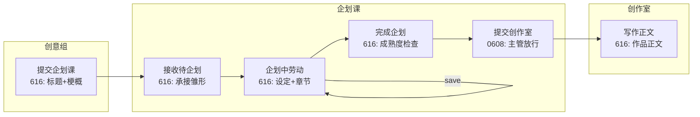

# 0608 / 616 协同机制草案

> 状态：会诊草案（只读）  
> 用途：衔接 **0608 流程宪法** 与 **616 内容资产宪法**，定义流程节点上的内容成熟度检查与权责划分  
> 关系：不替代 0608 状态机，不重新定义 616-B / 616-C 模型；只描述**交界处**  
> 执行边界：**只写文档；不改代码、不改 API、不改 schema、不写 migration**

---

## 0. 为什么需要本文

当前已形成两条宪法线：

| 宪法线 | 管什么 |
|--------|--------|
| **0608 五部门三状态宪法** | 流程决策：作品如何在五部门间流转、谁确认、谁放行、何时暂存 |
| **616 内容资产宪法**（v0.2.2） | 内容决策：作品由哪些资产构成、如何连续生长、读写边界 |

若缺少协同层，容易出现：

- 内容模型已定，却不知**在哪个流程按钮前检查什么**
- 保存设定时**隐式推进** `status`
- 「完成企划」与「提交创作室」混为一个动作
- 616 成熟度要求被写进 `status` 字段

本文填补该缝隙。

---

## 1. 文档位阶

```text
0608 流程宪法     = 流程动作、部门状态、放行、退回、暂存
616 内容宪法      = 内容资产、成熟条件、读写边界、连续生长
协同草案（本文）  = 两者交界处的检查点与责任划分
```

上位与并列依据：

| 文档 | 角色 |
|------|------|
| `0608-amendment-decision-separation.md` | 内容决策 ≠ 流程决策 |
| `0608-amendment-org-tier-model.md` | 确认完成（员工收工）≠ 放行（主管交接） |
| `616-content-asset-constitution-v0.2.1.md`（v0.2.2） | 四块资产、§2 连续生长 |
| `616-B-work-setting-minimal-model-draft.md` | 作品设定三必一选 |
| `creative-v2-consultation-agenda.md` | 创意组提交门槛、来源池 legacy |

---

## 2. 核心协同原则

### 2.1 分工

```text
616 定义内容资产最低成熟条件；
0608 定义这些条件在哪个流程动作中被检查、由谁确认、按钮放在哪里。
```

- **616** 回答：「够不够好可以交接？」（内容标准）
- **0608** 回答：「谁、在哪个列表、点哪个按钮、改哪个 status / 时间戳？」（流程事实）

### 2.2 不可混同

```text
内容变化不等于流程推进；
流程推进必须是独立、显式、可审计的动作。
```

| | 内容动作 | 流程动作 |
|---|----------|----------|
| **改变什么** | 标题、梗概、设定块、章节梗概、正文… | `status`、放行标记、`deletedAt`、交接时间戳 |
| **典型位置** | 详情页、编辑器、设定表单 | **部门工作台列表条目** |
| **典型按钮** | **save**：保存、保存草稿 | **submit** / **approve·release** / 暂存 |
| **禁止** | 保存时改 status | 流程时覆盖正文/设定 |

内容缺项检查可为流程按钮**提供依据**（禁用 / 提示 / 二次确认），但**不能**由内容编辑自动触发状态变化。

### 2.3 与科层模型对齐

| 0608 科层 | 与 616 的关系 |
|-----------|----------------|
| **员工层**（进行中工作区） | 做 616 内容劳动：补设定、建章节、写作、批注 |
| **主管层**（已完成工作区） | 在内容成熟度达标后，执行放行 / 退回 / 暂存 |
| **总经理层**（暂存池） | 对「种子不再成立」等争议件裁决，非改写字段 |

「完成企划」≈ 员工层收工（本部门进行中 → 已完成）；「提交创作室」≈ 主管层放行（本部门已完成 → 下游待处理）。**两步不得合并。**

动作语义完整链见 **§3**。

---

## 3. 动作语义层级

完整动作链：

```text
save  →  submit  →  approve / release  →  shelve / restore
```

**save** 是最底层、最日常、最不能与流程混淆的动作。

### 3.1 总规则

1. **save 永远不推进流程**——哪怕作品设定填完、章节也写完，点保存也只是保存内容；要进入下一阶段，必须另点 submit / approve / release。
2. **submit / approve / release / shelve / restore** 必须是**独立、显式、可审计**的流程动作。
3. **UI 文案**应让用户一眼区分「保存内容」与「推进流程」。

### 3.2 层级对照表

| 动作类 | 层级 | 含义 | 典型位置 |
|--------|------|------|----------|
| **save** | 编辑器 / 内容劳动中 | 保存内容，**不改变**流程状态 | 详情页、设定表单、编辑器 |
| **submit** | 员工层 | 提交本阶段成果：「我做完了，请检查/接收」 | 工作台列表条目（原则位） |
| **approve / release** | 经理层 | 批准进入下一阶段 | 工作台「已完成」列表条目 |
| **shelve / restore** | 总经理层 | 移出或恢复主流程 | 列表暂存 / 暂存池 |

说明：企划课 **接收待企划作品**（`accept-into-planning`）属经理层对上游 submit 的响应，语义贴近 **approve**，与员工层 submit 成对。

### 3.3 UI 文案指引（草案）

**save**

| 类型 | 示例 |
|------|------|
| 按钮 / 状态 | `保存`、`保存草稿`、`已保存` |
| 提示（推荐） | 仅保存当前内容，不改变作品流程状态。 |

**submit**

| 类型 | 示例 |
|------|------|
| 按钮 | `提交企划课`、`完成企划`、`完成写作`、`完成审阅` |
| 提示（推荐） | 提交本阶段成果，等待确认或放行。 |

**approve / release**

| 类型 | 示例 |
|------|------|
| 按钮 | `接收`、`提交创作室`、`提交编审部`、`归入文集库`（架构层为 release/handoff；UI 用户文案可用「提交」） |
| 提示（推荐） | 批准作品进入下一阶段。 |

**shelve / restore**

| 类型 | 示例 |
|------|------|
| 按钮 | `作品暂存`、`恢复作品`、`重新立项` |
| 提示（推荐） | 将作品移出或重新纳入主流程。 |

### 3.4 与流程节点表的对应

| §4 流程节点 | 动作类 |
|-------------|--------|
| 企划中内容劳动、创作室写作 | **save** |
| 提交企划课、完成企划、完成写作… | **submit** |
| 接收待企划、提交创作室、提交编审部… | **approve / release** |
| 作品暂存、恢复 | **shelve / restore** |

---

## 4. 流程节点 × 内容成熟度表

下表为协同层**主映射**；616 细则以 B/C 草案为准；0608 端点名以现有实现与 `0608-release-protocol` 为准。

| 0608 流程节点 | 616 内容要求 | 动作性质 | 典型位置 / 备注 |
|---------------|--------------|----------|-----------------|
| **创意组 · 提交企划课** | **必填**：标题 + 梗概（`synopsis`）。**可选**：作品预期（`_workExpectation`）、设定雏形（四块）、构思备注（`_creativeNotes`）、来源说明 | **流程动作** | 创意组工作台 · 创意作品条目。`Proposal.status` → `submitted` / `created`。产品标签 → **待企划作品** |
| **企划课 · 接收待企划作品** | 承接创意作品雏形（基础信息 + 可选设定雏形/备注）；不要求设定/章节已完善 | **流程动作** | 企划课「待企划」列表。`accept-into-planning` → 创建 `Project(status=planning)`，双向关联 `Proposal` |
| **企划课 · 企划中内容劳动** | 生长 **作品设定**（616-B 三必一选）+ **作品章节**（616-C）。默认先设定后章节，允许往返 | **内容动作（save）** | 企划中详情 / 设定页 / 章节规划。**仅 save**，不改 `planned` / 不放行创作室 |
| **企划课 · 完成企划** | **草案验收**：设定前三项有内容；≥1 章且每章有标题+章节梗概；叙事风格/创作心流可选。未达标可提示，是否硬拦见未决问题 | **流程动作**（员工层收工） | 企划课「企划进行中」**列表条目**。`planning → planned`（如 `confirm-planning-complete` / `confirm-greenlight`）。**不出现在作品详情 Tab 内** |
| **企划课 · 提交创作室** | 假定已完成企划时内容已达标；主管层确认可交接，不重复填表 | **流程动作**（主管层放行） | 企划课「已完成企划」**列表条目**。`release-to-studio` + 交接时间戳 / metadata 标记。**与完成企划分离** |
| **创作室 · 开始写作** | 承接作品设定 + 章节结构；以章为单位写 **作品正文** | **内容动作**（主）+ 可选流程（标记开始写） | 创作室进行中：编辑器写正文；设定/章节可调整但属内容生长 |

### 4.1 节点关系图（企划课段）



**关键分离：**

- `C → C`：内容保存，不触发 `D` 或 `E`
- `D` 与 `E`：两个流程动作；`D` 检查内容成熟度；`E` 不替代 `D` 的内容劳动

---

## 5. 权责分离

### 5.1 内容侧

- 内容编辑入口（详情、表单、编辑器）**可以提示缺项**（「人物与关系尚未填写」）。
- **保存**只写内容资产字段 / metadata 内容键，**不**写 `status`、不放行标记。
- 自动保存、离开页提示等，均属内容决策。

### 5.2 流程侧

- **流程按钮**负责真正推进：改 status、写时间戳、写 `releaseHandoff` 类 metadata。
- 按钮**主位置**：**部门工作台列表条目**（0608 decision-separation §2.2、§2.3）。

**流程按钮原则上应放在部门工作台列表条目。**

**Tab 本身**与**编辑器保存动作**中不得放置流程按钮。

若因历史实现或过渡体验**暂时**保留在详情页，必须满足：

1. **单一职责**：只推进流程，不连带保存内容；
2. **有明确确认**（如二次确认或独立确认步骤）；
3. **后续应收敛**回工作台条目（过渡态，非目标态）；
4. **不得**放在 Tab 本身或编辑器保存动作中。

目标态（0608 P0）：详情页 / Tab / 编辑器内不承载「完成企划」「提交创作室」等主管层流程按钮；创意组「提交企划课」是否暂留详情页见 §12。

### 5.3 企划中准备度

- 企划中页面可显示 **「可完成企划」准备度**（设定三必、章节数量等），属**只读摘要 + 提示**。
- 准备度条 **不能** 自动调用 `confirm-planning-complete`。
- 用户须在列表条目上**显式点击**「完成企划」。

### 5.4 技术名与产品标签

- 流程层可保留 `Proposal`、`Project.status` 等**技术名**。
- 产品标签遵循 creative-v2 / P1-copy：**创意作品**、**待企划作品** 等。
- **616 成熟度不得映射为新的 status 字面量**（例如不得新增 `setting_complete` 状态）。

---

## 6. 创意组 → 企划课协同

依据 `creative-v2-consultation-agenda` 第一组 + 616 §2 连续生长。

| 项 | 协同规则 |
|----|----------|
| 提交硬门槛 | **仅标题 + 梗概** |
| 不阻断提交 | 作品预期、设定雏形、构思备注、来源说明（`_sourceType` / `_sourceNote` / 弱 `_sourceRef`） |
| 提交后 | 产品标签 **待企划作品**；`Proposal` 进入企划课待接收池 |
| 技术载体 | `Proposal` 技术名可保留；`_creativeStage` 与 `status` 映射见 creative-v2 未决项 |
| 内容≠流程 | 「保存创意作品」（**save**）≠「提交企划课」（**submit**）；提交流程按钮位置见 §5.2 |

企划课接收时 **616 不要求** 设定/章节已齐——只要求承接创意组已交付的种子与可选雏形。

---

## 7. 企划课 → 创作室协同

依据 616-B §6、616 宪法 §5 企划课枝干。

### 7.1 两类内容劳动（企划中）

| 劳动 | 宪法归属 | 协同说明 |
|------|----------|----------|
| 作品设定 | **616-B** | 三必一选；承接创意组设定雏形（若有），**不从空白表单开始** |
| 作品章节 | **616-C** | 顺序、标题、章节梗概、状态；与设定分模型 |

默认引导：**先设定基底，再章节构建**；允许往返调整。往返仅为**内容编辑顺序**，不产生流程事件。

### 7.2 完成企划（流程）

- **检查依据**：616-B 前三项 + 616-C 最低章节草案（见 B 草案 §6.2）。
- **动作**：`planning → planned`；条目进入企划课「已完成企划」工作区。
- **性质**：本部门**确认完成**（员工层 **submit**），**不是**提交创作室。

### 7.3 提交创作室（流程）

- **前提**：条目已在「已完成企划」；内容在 `D` 步骤应已达标。
- **动作**：`release-to-studio`（及交接 metadata / 时间戳）；创作室「待创作」可见。
- **位置**：企划课已完成列表条目；**不在** WorkDetail Tab 内。
- **性质**：主管层 **approve / release**，可审计；不隐式修改设定/章节正文。

### 7.4 创作室接入

- 创作室**承接**设定与章节结构，生长 **作品正文**。
- 创作室可调整设定与章节（616 连续生长），属内容动作；跨阶段不退回（0608 不变量）。

---

## 8. 暂存机制协同

### 8.1 何时暂存

若 **标题 / 梗概 / 作品身份级种子** 不再成立：

- **不应**在主流程详情里静默改写身份级字段「换一部作品」。
- **应**走 0608 **作品暂存**（`deletedAt` 软删 / 文件暂存池）或 **重新立项**（新 Proposal / 新 Project 链路）。

依据 616 §2 连续生长 + §5 企划课「不可替换作品身份」。

### 8.2 暂存是流程动作

| 是 | 不是 |
|----|------|
| 列表条目「暂存」按钮 | 在设定表单加「废弃」字段 |
| 写 `deletedAt` / 暂存池 metadata | 清空梗概代替暂存 |
| 总经理层暂存池裁决（远期） | 用内容保存表达「不想写了」 |

暂存 **不得**改写作品正文、设定四块、章节正文等核心内容（0608 decision-separation §3.4）。

### 8.3 与创意组退回区分

- 企划课 **退回**待企划作品 → 创意组可再编辑（流程 + 有限内容修订），非暂存。
- **跨部门不退回**（0608）；争议用暂存 + 重新立项。

---

## 9. 实现前检查清单

未来任何实现卡（含 Creative-v2-A、616-B-A、616-C、企划工作台）合并前，须自检：

### 9.1 内容 vs 流程

- [ ] **save** 是否永远不推进 `status` / 放行标记？（§3.1）
- [ ] 是否把**内容保存**误当成**流程推进**？
- [ ] `PUT` 内容接口是否顺带改 `status` / 放行标记？
- [ ] 流程端点是否顺手覆盖梗概/设定/章节？

### 9.2 按钮位置

- [ ] 是否把**流程按钮**放进详情页 / Tab / 编辑器？
- [ ] Tab 点击是否只筛选、不触发接收/完成/放行？
- [ ] 工作台流程动作是否锚定在**具体作品条目**？

### 9.3 成熟度与状态

- [ ] 是否在**未完成** 616-B/C 草案成熟度时仍允许「完成企划」？（若允许，是否显式警告并记录未决政策）
- [ ] 是否把 616-B 设定字段**写成** 0608 `status` 或新状态字面量？
- [ ] 是否将「设定前三项已填」存成流程标记而非内容字段？

### 9.4 企划课双动作

- [ ] 「完成企划」与「提交创作室」是否**分离**？
- [ ] `planned` 在企划课 vs 创作室语义是否靠**部门上下文**区分，而非全局 NEXT_STATUS？

### 9.5 创意组与 legacy

- [ ] 提交企划课是否仅检查**标题+梗概**？
- [ ] 新流程是否**不新增** `references[]` 强绑定（creative-v2 第三组）？
- [ ] 是否保留**暂存**作为种子失效的流程口子？

### 9.6 连续生长

- [ ] 企划课是否**承接**创意组雏形，而非空表单？
- [ ] 身份级字段是否在接收后**原则上只润色、不替换**？

### 9.7 动作语义与文案

- [ ] 保存按钮是否带「不改变流程状态」类提示（§3.3）？
- [ ] submit / release / 暂存 是否与用户心智层级一致、未与 save 混排？

---

## 10. 与 0608 的关系

| 本文落实的 0608 原则 | 说明 |
|----------------------|------|
| decision-separation | 内容/流程分轨；本表指定每节点属哪一类 |
| org-tier-model | 完成企划 ≠ 提交创作室；员工收工 vs 主管放行 |
| 工作台条目锚点 | 流程按钮在列表，不在详情 Tab |
| release-protocol | 放行产生交接事实；616 不替代端点设计 |
| 文件暂存池 | 种子失效走暂存，非改内容 |

**本文不重新定义** 0608 状态机字面量、桶转换白名单、端点 URI；若与现状代码不一致，以 0608 宪法 + 协同成熟度为准逐步对齐。

---

## 11. 与 616-B / 616-C 的关系

| 文档 | 协同层如何使用 |
|------|----------------|
| **616-B** | 「完成企划」前的设定成熟度；企划中内容劳动的一半 |
| **616-C** | 「完成企划」前的章节成熟度；企划中内容劳动的另一半 |
| **616 §2 连续生长** | 各阶段承接表与暂存原则的上位依据 |
| **creative-v2** | 创意组提交门槛、待企划标签、来源 legacy 边界 |

616-B / 616-C **未决项**（如三必是否硬门槛）在流程节点表中标注为「草案验收 / 未决」；协同层不提前裁决，但要求流程实现**预留检查钩子**。

---

## 12. 未决问题

1. **完成企划**时，616-B/C 草案成熟度是**硬门禁**还是**警告 + 可强制完成**？
2. **作品预期**在「接收待企划」还是「完成企划」时硬拦？
3. 创意组详情页是否**继续保留**「提交企划课」（**submit**）按钮？（原则位：工作台列表；若暂留须符合 §5.2 过渡四条；目标态是否收敛至列表）
4. `planned` + 未 `release-to-studio` 时，创作室列表是否**严格**不可见（与 release-protocol 执行规格对齐）？
5. 准备度 UI 的粒度：按块展示 vs 单一百分比？
6. legacy 自动拆章：若触发，算内容动作还是流程副作用？（倾向：616-C 显式动作，见 creative-v2 第三组）

---

## 13. 验收对照（本文档自身）

| 标准 | 状态 |
|------|------|
| 说明 0608 与 616 分工 | ✓ §1–§2 |
| 动作语义层级（save / submit / release / shelve） | ✓ §3 |
| 流程节点 × 内容成熟度 | ✓ §4 |
| 内容动作与流程动作不可混同 | ✓ §2.2、§3、§5 |
| 完成企划与提交创作室分离 | ✓ §4、§7 |
| 暂存与种子失效 | ✓ §8 |
| 无代码改动 | ✓ |

---

## 参考文档

- `docs/design/0608-constitutional-guidance/0608-amendment-decision-separation.md`
- `docs/design/0608-constitutional-guidance/0608-amendment-org-tier-model.md`
- `docs/design/616-content-asset-constitution-v0.2.1.md`（v0.2.2）
- `docs/design/616-B-work-setting-minimal-model-draft.md`
- `docs/design/creative-v2-consultation-agenda.md`

---

## 修订记录

| 版本 | 日期 | 说明 |
|------|------|------|
| draft-0 | 2026-06-16 | 0608 / 616 协同机制首版草案 |
| draft-1 | 2026-06-16 | 统一 §5.2 流程按钮位置与详情页过渡规则 |
| draft-2 | 2026-06-16 | 新增 §3 动作语义层级（save / submit / release / shelve） |
