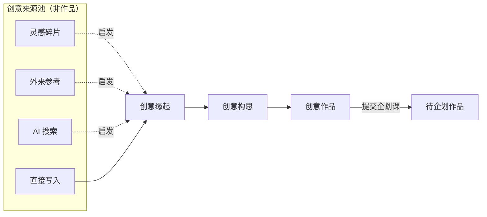

# 创意组机制 v2 立宪草案

> **状态**：历史 · 阶段性设计输入 · 不作为当前基线 · 最后核对 2026-08-11
> 用途：创意组机制 v2 会诊的立宪输入；指导后续实现战役，**不直接代表代码已实现**
> 关系：服从 `0608 五部门三状态宪法` 与 `616 内容资产宪法 v0.2.1`；是 **616-B 的上游校准**，不替代 616-B
> 基线：`feature/workdetail-p1`（616-A 已合并，P1-copy 已 push）——**当时**执行环境，开工以当前 `origin/master` 为准
> 执行边界：本文档只写产品与设计原则；**不改代码、不改 API、不改 schema、不做迁移**

---

## 0. 文档位阶

| 文档 | 管什么 |
|------|--------|
| 0608 五部门三状态宪法 | 作品如何在五部门间流转 |
| 616 内容资产宪法 v0.2.1 | 作品由哪些内容资产构成、如何读写 |
| **本文（创意组 v2 立宪草案）** | 创意组阶段的产品链路、边界、旧实现处置原则 |
| 616-B（未启动） | 作品设定最小模型、旧六字段去留、WorldBuilding 处置 |

现场代码、旧页面、旧字段均服从上述文档。**旧实现不决定 v2 方向**，只作为迁移摩擦与兼容风险清单。

---

## 1. 创意组 v2 的定位

### 1.1 在五部门流程中的角色

创意组是**作品生命的源头**，负责把散乱灵感收束为**可进入企划课的作品种子**。

在 0608 流程中，创意组对应 Proposal 阶段的 `creating`（兼容别名 `draft`）至提交企划课前的全部工作；提交后，同一对象在企划课侧以**待企划作品**（产品标签）呈现，技术名仍可称 `Proposal`。

创意组 v2 的产品使命：

> 让作者从「有一闪而过的念头 / 有一篇外来材料 / 有一段碎片笔记」出发，经过有意识的培育与澄清，交付一份**最小但可交接**的创意作品，供企划课开始枝干建设。

### 1.2 创意组不负责什么

创意组 **不负责** 以下内容（归属下游部门或 616-B）：

| 不负责 | 归属 |
|--------|------|
| 完整作品设定 | 616-B + 企划课 |
| 章节骨架 / 大纲 | 企划课（作品章节） |
| 正文写作 | 创作室（作品正文） |
| 编审判断 | 编审部 |
| 文集呈现 | 文集库 |
| AI prompt 最终结构 | 616 宪法 §6 + 后续专项 |
| 旧创作资料线扩展 | 616 宪法 §3（冻结） |

### 1.3 与 616 内容资产的关系

按 616 宪法 §2、§4，创意组只创建**作品基础信息**中的种子：

- 标题
- 梗概
- 作品预期（可选，具体存储待后续裁决）

创意组**不要求**完成作品设定、作品章节、作品正文。v2 立宪在此之上增加**过程层概念**（创意缘起、创意构思），不改变 616 四块内容资产的划分。

---

## 2. 四段链路定义

司令部最新产品链路：

```text
创意缘起 → 创意构思 → 创意作品 → 待企划作品
```

四段均为**产品阶段标签**，描述作者心智与交付物；不等同于数据库表名，也不要求立即新建实体。

### 2.1 总览



| 阶段 | 一句话 | 与旧 `Proposal` 的关系 |
|------|--------|------------------------|
| 创意缘起 | 作品创意开始萌芽的第一枚种子 | 可能是 Proposal 的前态或轻量记录；**v2 不强制独立表** |
| 创意构思 | 围绕种子培育、补全、澄清 | 对应 Proposal `draft` / `creating` 的主工作态 |
| 创意作品 | 创意组阶段形成的作品雏形 | 对应已成形、可提交的 Proposal |
| 待企划作品 | 提交企划课后的阶段标签 | 对应 `submitted` / `created`（及评估中状态）；技术名仍为 Proposal |

---

### 2.2 创意缘起

#### 这是什么

作品创意**开始萌芽的第一枚种子**。可以来自外来参考、灵感碎片、AI 搜索，也可以由作者直接写下。

创意缘起**不是**：

- 引用绑定关系
- 资料库条目本身
- 已成立的创意作品

来源只是**启发来源**，不强绑定作品；作者可以不经过任何来源池，直接新建创意缘起。

#### 谁创建

作者；系统可在 AI 搜索、外来参考浏览等场景**辅助生成**缘起草稿（AI 能力未落地前可为占位原则）。

#### 最小内容

| 字段 | 必填 | 说明 |
|------|------|------|
| 标题 | 否 | 可暂用「未命名」 |
| 梗概 | 否 | 一两句话即可 |
| 作品预期 | 否 | 想写成什么样的作品；与梗概不可混为一谈（616 §2.1） |
| 来源说明 | 否 | 自由文本：「来自某某参考 / 某次搜索 / 某条碎片」 |
| 来源类型 | 否 | 枚举：`直接写入` / `灵感碎片` / `外来参考` / `AI 搜索` |

#### 是否可编辑

是。创意缘起处于高度流动态，可随时修改、合并、放弃。

#### 何时进入下一阶段

作者主动选择「开始创意构思」，或系统默认将非空缘起升级为构思中的作品。

**产品原则**：缘起 → 构思应是**显式或自然升级**，而非「必须先绑定 references 才能继续」。

#### 与旧 `Proposal` 的关系

- **过渡策略（草案）**：创意缘起可先由**轻量 Proposal 记录**承载（仅基础字段 + 来源说明/metadata），或独立 UI 态下的同表不同「阶段标记」；**不在本草案中裁决是否新建实体**（见 §8 未决问题）。
- 不占用 `references[]` 强绑定语义；来源信息优先落在**来源说明 + 来源类型**，而非 ReferencePicker 式快照数组。

---

### 2.3 创意构思

#### 这是什么

围绕创意缘起进行**培育、补全、澄清**的过程。创意构思是创意组**最重要的枢纽**——作者在此把种子养大，直到足以称为创意作品。

**不是**旧 `CreativeDiscussion` 的原样复活：v2 不以「讨论评估区」「成型提案」为主心智，而以**「新作品创意构思」**为主入口文案。

#### 谁创建

作者；由创意缘起升级而来，或跳过缘起直接「新作品创意构思」。

#### 最小内容

创意构思阶段建议逐步补齐标题、梗概、作品预期；提交为创意作品前是否必填，列入 §8 未决问题。

| 字段 | 建议 | 说明 |
|------|------|------|
| 标题 | 尽早补齐 | 作品称呼 |
| 梗概 | 尽早补齐 | 故事讲什么 |
| 作品预期 | 尽早补齐 | 想写成什么样的作品；与梗概不可混为一谈（616 §2.1） |
| 构思备注 | 可选 | 过程性笔记、澄清记录；候选承接旧 `_evaluation` 语义 |
| 来源说明 | 可选 | 自缘起继承，可补充 |

#### 是否可编辑

是。构思中作品可随时保存草稿；未提交企划课前均可修改标题、梗概、作品预期、构思备注、来源说明。

#### 何时进入下一阶段

作者确认「创意作品已成形」，执行**提交企划课**操作（具体提交门槛见 §8）。

#### 与旧 `Proposal` 的关系

- 技术承载：`Proposal.status` 为 `creating` / `draft` 的记录。
- 主编辑体验：`ProposalDetailPage` 为 v2 **构思 / 作品主编辑页**的改造基础（见 §6）。
- 旧 `_discussionSubmitted` **不作为** v2 主状态（见 §4）。

---

### 2.4 创意作品

#### 这是什么

创意组阶段的**阶段成果**——已具备最小交付内容、准备交接企划课的作品雏形。

创意作品**不是**：

- 完整作品设定
- 章节骨架
- 带正文的作品

#### 谁创建

作者在创意构思中完成培育后**成形**；系统可提示缺项，但不替代作者确认。

#### 最小交付内容

| 字段 | 草案倾向 |
|------|----------|
| 标题 | 是 |
| 梗概 | 是 |
| 作品预期 | 是 |

**作品预期是否作为提交硬门槛，待司令部裁决。**

可选附带：构思备注、来源说明、来源类型（不作为提交硬门槛）。

#### 是否可编辑

提交企划课前：可编辑。  
提交后：进入「待企划作品」，按 616 §4 创意组规则——**标题与梗概原则上不再在创意组原地改写**；若种子不再成立，走**作品暂存**而非主流程内推翻。

#### 何时进入下一阶段

作者执行「提交企划课」→ 产品标签变为**待企划作品**；`Proposal.status` 转为 `created` / `submitted`（legacy 映射保留）。

#### 与旧 `Proposal` 的关系

- 同一 `Proposal` 记录，阶段标签变化。
- `synopsis` 承载梗概（616-A2 已收口读写；立项时双写至 Project）。
- 提交时不以 `references[]` 非空为前提。

---

### 2.5 待企划作品

#### 这是什么

创意作品**进入企划课之后**的阶段标签。表示：创意组已完成种子交付，企划课开始承担枝干建设（作品设定、作品章节等）。

#### 谁创建

作者提交；企划课接收前，对象仍为同一 `Proposal`。

#### 最小内容

继承创意作品最小交付内容；企划课可**补充 / 受限润色**作品基础信息（616 §4），但不可替换作品身份。

#### 是否可编辑

创意组视角：只读或归档。  
企划课视角：评估、接收、完善设定与章节（616-B 定细节）。

#### 何时进入下一阶段

企划课 **accept-into-planning**（接收）→ 创建 `Project(status: planning)`，Proposal 关联 `projectId`；产品进入「企划进行中」。

#### 与旧 `Proposal` 的关系

- **技术名可仍为 `Proposal`**；产品层**不再使用「企划建议书」**（P1-copy 已治理 UI 文案）。
- 待企划 ≠ 已立项；立项后主体迁移至 `Project`，Proposal 保留溯源关系。

---

## 3. 三个创意来源的边界

### 3.1 总原则

```text
外来参考 / 灵感碎片 / AI 搜索 是创意来源池，不直接等于作品，也不直接绑定作品。
```

| 来源 | 是什么 | 不是什么 |
|------|--------|----------|
| 灵感碎片 | 作者随时记录的想法片段 | 创意作品本身 |
| 外来参考 | 导入的外部文件/链接及标注 | 作品的必填附件 |
| AI 搜索 | 检索与对话产生的启发材料（远期） | 自动立项入口 |

### 3.2 出口：创意缘起

三个来源的**产品出口**是「创意缘起」——作者从来源池获得启发后，用缘起承载「我想写什么」的第一笔，而非把来源条目「挂载」到作品上。

作者也可以**不通过来源池**，直接新建创意缘起 / 新作品创意构思。

### 3.3 与 ReferencePicker 式强绑定的切割

现状：`CreativeDiscussion` + `ReferencePicker` 将 `references[]` 作为构思核心动作，形成「先选材料再成作品」的 1.0 心智。

v2 原则：

- **不继续强化** ReferencePicker 式强绑定。
- 未来如需保留来源追溯，应作为：
  - **来源说明**（自由文本），或
  - **可选来源关联**（弱链接，非成立前提）
- `references[]` 在 v2 产品层**降级**（见 §4）；实现层可只读兼容旧数据。

### 3.4 来源池与创意构思的隔离

| 层 | 职责 |
|----|------|
| 来源池 UI | 管理碎片 / 参考 / 搜索；**不**编辑作品字段 |
| 创意构思 UI | 编辑标题、梗概、作品预期、构思备注；**不**要求从来源池勾选才能保存 |
| 枢纽页 | 展示来源池入口 + 构思中 / 已成形作品列表；两者**并列**，非嵌套 |

`CreativeWorkspace` 三列结构（来源 / 构思中 / 创意作品）符合此隔离原则，可作为 v2 枢纽基础。

---

## 4. 旧字段处理原则

以下仅**产品层原则**，不涉及代码方案、迁移脚本或 API 变更。

| 旧字段 | v2 产品层原则 |
|--------|----------------|
| `Proposal.synopsis` | **保留**为创意作品梗概的唯一标准字段；与 616-A2 读模型一致；立项时双写至 Project |
| `Proposal.innovation` | **降级**为遗留字段；不作为 v2 核心概念；UI 不再突出「创新点」表单；只读兼容旧数据 |
| `Proposal.coreSetting` | **暂不裁决**；与 616-B 作品设定最小模型边界重叠；v2 创意组不扩展其编辑入口 |
| `Proposal.metadata._evaluation` | **降级**为构思备注 / 过程痕迹的**候选**承接字段；产品语言不再称「评估」；是否重命名为 `creativeNotes` 等待 §8 裁决 |
| `Proposal.references` | **降级**为来源说明 / 可选来源关联的**候选**存储；不作为强绑定；新流程不以 references 非空为提交条件 |
| `Proposal.metadata._discussionSubmitted` | **废弃为主状态**；旧 CreativeDiscussion 二阶段遗留；v2 以 Proposal.status + 阶段标签划分，不恢复 `_discussionSubmitted` 分区 |

### 4.1 作品预期

616 宪法 §2.1 已定义「作品预期」与「梗概」不可混为一谈。616-A 明确**未解决**作品预期的存储与 UI。

v2 立宪裁定：

- **概念上**，作品预期是创意组最小交付内容之一。
- **存储与编辑方式**不在本文裁决，列为 §8 未决问题。
- 在存储未定前，产品文案与表单可预留位置，但**不得**用 `innovation` 或 `coreSetting` 顶替。

---

## 5. 与 616-B 的关系

### 5.1 分工

```text
创意组 v2 是 616-B 的上游校准，但不替代 616-B。
```

### 5.2 创意组 v2 可以裁决

| 可裁决 |
|--------|
| 创意组产出什么（最小交付：标题 + 梗概 + 作品预期） |
| 四段链路定义与阶段标签 |
| 创意缘起 vs 创意构思的边界 |
| 创意来源池 vs 构思的隔离 |
| 进入企划课时交接什么（作品基础信息种子，不含完整设定） |
| 旧字段的产品层去留与降级 |
| 历史 UI 组件的保留 / 冻结 / 废弃原则 |

### 5.3 创意组 v2 不裁决

| 不裁决（归属 616-B 或后续） |
|------------------------------|
| 作品设定最小字段集 |
| 作品章节模型与存储 |
| WorldBuilding / Character / Timeline / CreativeFlow 是否重启 |
| 旧六字段、`settings`、背景设定最终去留 |
| 企划课内作品设定的编辑形态 |
| AI prompt 最终结构与适配层 |
| DB 迁移、双轨写入实现细节 |

### 5.4 交接契约（草案）

创意组提交 → 企划课接收时，**至少**交接：

- 标题
- 梗概（`synopsis`）
- 作品预期（存储位置待定，但语义必须交接）
- 可选：构思备注、来源说明

**不交接**为企划课默认内容：

- 完整作品设定
- 章节骨架
- 旧创作资料线数据（若存在，按 616 §3 冻结只读）

---

## 6. UI / 运行逻辑原则

本文只写原则，不画完整 UI，不写实施步骤。

### 6.1 主入口

- 创意组主入口文案：**「新作品创意构思」**（或等价 CTA）。
- 默认路由 `/creative/chat` 继续作为创意组枢纽；顶栏「创意组」进入此页。

### 6.2 枢纽与编辑

| 组件 | v2 原则 |
|------|---------|
| `CreativeWorkspace` | **改造基础**；保持「来源池 | 构思中 | 创意作品」三列；强化阶段标签，弱化 1.0 Tab 心智 |
| `ProposalDetailPage` | **改造基础**；作为创意构思 + 创意作品的主编辑页；字段对齐 §2.3 / §2.4 最小内容 |
| `ScrapNote` / `ExternalRefs` | **保留**为来源池；与构思编辑隔离；返回链指向枢纽 |
| `CreativeDiscussion` | **不原样复活**；其三栏交互、Tag 过滤、草稿保存等**有价值能力**可吸收进 Workspace + DetailPage，但不用「讨论评估」语言 |

### 6.3 来源池

- 来源池页面**不**承担作品字段编辑。
- 从来源到构思的路径：**「以此为启发，开始创意构思」**（或等价），生成/打开缘起或构思记录，而非 `references[]` 批量绑定。

### 6.4 提交与企划课衔接

- 创意作品在 DetailPage（或等价）执行「提交企划课」。
- 提交后：创意组枢纽右列 / 企划课「待企划」列显示**待企划作品**。
- 企划课评估页（现 `ProposalEvalPage`）承接接收；产品标签统一，技术路由可不变。

### 6.5 显式不做

- 不在创意组开放 WorldBuilding 可写入口（616 §3 冻结）。
- 不在 v2 恢复 L2 五 Tab（外来参考 | 灵感手记 | AI 搜索 | 创意讨论 | 企划建议书）并列导航；改为枢纽 + 深链。

---

## 7. 历史实现处理原则

按 616 宪法 §7 五类处置：**保留 / 改造 / 冻结 / 迁移 / 废弃**。

| 对象 | 处置 | 说明 |
|------|------|------|
| `CreativeWorkspace` | **改造** | v2 枢纽基础；对齐四段链路与三列语义 |
| `ProposalDetailPage` | **改造** | v2 主编辑页基础；字段与提交门槛对齐 §2 |
| `ScrapNote` | **保留** | 来源池；文案已对齐「灵感碎片」 |
| `ExternalRefs` | **保留** | 来源池；与构思隔离 |
| `ReferencePicker` | **冻结 → 废弃（产品层）** | 不强绑定心智；代码可暂留只读兼容，不进入 v2 主路径 |
| `CreativeDiscussion` | **废弃（主路径）** | 不挂路由、不原样复活；有价值交互**迁移**至 Workspace + DetailPage |
| `PlanningProposal` | **废弃** | 已由 `PlanningPage` + `ProposalEvalPage` 替代 |
| `ProposalReviewPage` | **废弃** | 列表职责已并入 `PlanningPage` |
| `ChatPage` | **废弃** | 占位；`/creative/chat` 已用 Workspace |
| `ProposalsPage` / `ReferencesPage` | **废弃** | 路由已重定向；不再恢复为独立 Tab |
| `WorldBuildingPage` | **冻结** | 616 §3；创意组不可达；评估页 / WorkDetail 遗留资料只读 |
| `Proposal` 技术名 | **保留** | API、路由、DB 不重命名；产品层用阶段标签 |
| legacy status 映射 | **保留（双轨兼容）** | `draft/submitted/...` 与 `creating/created/...` 继续映射；v2 产品文案用阶段标签，不暴露 legacy 字面量 |
| `TypeLabel` / processingType | **保留** | 来源池内引用类型仍有价值；与作品弱绑定 |
| `innovation` / `coreSetting` UI | **冻结** | 不从 DetailPage 扩展；等 616-B |
| `_evaluation` 展示 | **迁移（语义）** | 产品改称「构思备注」；字段名迁移待定 |
| `references[]` | **冻结 + 只读兼容** | 旧数据可读；新流程不以之为中心 |

---

## 8. 未决问题

以下需司令部后续裁决；**本文档不定案**。

### 8.1 阶段与字段

1. **作品预期**：创意缘起阶段是否可选、创意作品阶段是否必填？存储于 `Proposal` 新字段、`metadata` 键，还是立项后才写入 `Project`？
2. **`coreSetting`**：是否进入 616-B 作品设定？创意组是否 ever 暴露编辑入口？
3. **`_evaluation`**：是否正式迁移为 `creativeNotes`（或等价 metadata 键）？与 `synopsis` 的分工如何写进作者指引？
4. **创意缘起实体**：是否需要独立实体 / 状态，还是先用 `Proposal` + 阶段 metadata 承载？

### 8.2 来源与 AI

5. **来源说明**：纯自由文本，还是结构化 `{ type, id?, note? }` 弱关联？
6. **AI 搜索**：上线后如何生成创意缘起？是否默认进入「直接写入 + 来源类型=AI 搜索」？
7. **旧 `references[]` 数据**：只读展示多久？是否映射为来源说明？

### 8.3 流程与状态

8. **创意缘起 → 构思**：一键升级还是自动合并多条缘起？
9. **构思中 vs 已成形**：是否仍需显式「标记为创意作品」步骤，还是填齐三项即视为可提交？
10. **legacy status 统一**：v2 实现战役是否顺带推进 Day1 主体字面量，还是继续双轨？
11. **退回路径**：企划课退回后，回到「创意构思」还是「待修改的创意作品」？与 616 §4 暂存原则如何对齐？

### 8.4 与下游衔接

12. **提交时校验**：作品预期为空是否阻断提交？
13. **立项后作品预期**：是否在企划课继续 editable？与梗概「原则上不改」的例外边界？

---

## 9. 验收对照（本文档自身）

| 标准 | 状态 |
|------|------|
| 能独立解释创意组 v2 产品链路 | ✓ §2 |
| 明确「创意缘起」定义与边界 | ✓ §2.2、§3 |
| 明确来源池与构思隔离 | ✓ §3 |
| 明确旧字段处理原则 | ✓ §4 |
| 明确与 616-B 边界 | ✓ §5 |
| 不做代码实现 | ✓ 全文为设计草案 |

---

## 10. 参考输入

- `docs/design/616-content-asset-constitution-v0.2.1.md`
- `TASK-616-A-closure.md`
- 创意组机制现状图（2026-06-16 会话产出）
- `feature/workdetail-p1` 代码现状（`CreativeWorkspace`、`ProposalDetailPage`、`CreativeDiscussion` 双轨等）

---

## 修订记录

| 版本 | 日期 | 说明 |
|------|------|------|
| draft-0 | 2026-06-16 | 首版立宪草案；只读设计，无实现承诺 |
